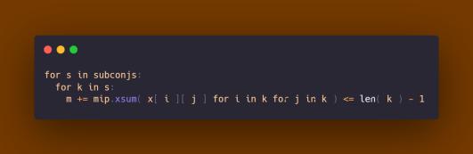

# **O problema do Caixeiro Viajante**

Eduardo Costa Miranda Azevedo - 12677151

Ivan Barbosa Pinheiro -   9050552

Raquel de Jesus Santos Valadão - 12674022

São Carlos

2022
 

UNIVERSIDADE DE SÃO PAULO

CAMPUS DE SÃO CARLOS

INSTITUTO DE CIÊNCIAS MATEMÁTICAS E DE COMPUTAÇÃO (ICMC)

# **O problema do Caixeiro Viajante**

Relatório do trabalho **O problema do Caixeiro Viajante** dado como exigência para obtenção de menção na disciplina de **Introdução à Pesquisa Operacional (SME0510)**, sob orientação do Prof. Dr. Elias Salomao Helou Neto.

## **1 - Introdução**

O problema do caixeiro viajante (também conhecido como o problema do agente viajante, ou simplesmente o problema do TSP, da sigla em inglês "Travelling Salesman Problem") é um problema clássico da teoria dos grafos, que envolve encontrar o menor caminho possível que passa por todos os vértices de um grafo uma única vez, retornando ao ponto de partida.

O problema é chamado assim porque é comumente utilizado para modelar situações em que um vendedor precisa visitar uma série de cidades e precisa encontrar a rota mais curta possível para fazer isso. No entanto, o problema do caixeiro viajante pode ser aplicado em muitas outras situações em que é necessário encontrar o menor caminho possível através de um conjunto de pontos.

O problema do caixeiro viajante é um problema NP-difícil, o que significa que, para problemas com um número muito grande de vértices, é muito difícil encontrar uma solução exata. No entanto, existem algoritmos que podem encontrar soluções aproximadas para o problema, mesmo para grafos muito grandes, e esses algoritmos são frequentemente utilizados na prática.

	

## **2 - O Algoritmo**

### **2.1 - Lista de pontos**

### Criando uma lista de 21 pontos aleatórios em um plano 2D, onde cada ponto é gerado como um vetor de duas dimensões:

Esse código está criando uma lista de 21 pontos aleatórios em um plano 2D. O número de pontos é determinado pelo valor de `n`, que é inicializado com 21.

O loop `for` percorre os índices de 0 a `n-1`, adicionando um ponto aleatório a cada iteração. O ponto aleatório é gerado pelo método `np.random.normal()`, que gera números aleatórios com distribuição normal (também conhecida como Gaussiana). O método recebe como parâmetro o tamanho do vetor de saída, que no caso é `(2,)`, o que significa que cada ponto aleatório será um vetor de duas dimensões.

Os pontos gerados são adicionados à lista `nodes`. No final, a lista `nodes` conterá 21 pontos aleatórios no plano 2D.

### **2.2 - Distância entre os pontos**

### Calculando distâncias entre todos os pares de pontos:

Aqui, temos que este trecho está percorrendo todas as combinações possíveis de pares de pontos (`i` e `j`) e calculando a distância entre eles. O primeiro loop `for` percorre os índices dos pontos (`i`), enquanto o segundo loop `for` percorre os índices dos pontos (`j`) para cada valor de `i`. O loop interno começa em `i + 1`, o que significa que ele só percorre os índices maiores que `i`. Isso é feito para evitar contar duas vezes a mesma distância, já que a distância entre os pontos `i` e `j` é a mesma da distância entre os pontos `j` e `i`.

Para cada par de pontos `i` e `j`, o código calcula a distância entre eles usando a função `np.linalg.norm()`, que calcula a norma Euclidiana entre dois pontos. A norma Euclidiana é uma medida de distância entre dois pontos em um espaço Euclidiano. No caso desse código, os pontos são os vetores `nodes[i]` e `nodes[j]`, que representam as coordenadas dos pontos `i` e `j`, respectivamente.

O resultado da função `np.linalg.norm()` é armazenado na posição `C[i][j]` da matriz `C`. Depois, o mesmo valor é armazenado na posição `C[j][i]` da matriz `C`. Dessa forma, a distância entre os pontos `i` e `j` é armazenada em ambas as posições da matriz, o que permite acessar a distância de qualquer ponto para qualquer outro ponto de forma simétrica.

No final do loop, a matriz `C` terá as distâncias entre todos os pares de pontos armazenadas. Por exemplo, se a matriz `C` for uma matriz 4x4, a distância entre os pontos 0 e 1 estará armazenada na posição `C[0][1]` e `C[1][0]`, a distância entre os pontos 0 e 2 estará armazenada na posição `C[0][2]` e `C[2][0]`, e assim por diante.

### **2.3 - Modelo de programação linear**

### Criação de modelo de programação linear inteira mínima (PLI) usando o pacote MIP:

Outrossim, o código abaixo está criando um modelo de programação linear inteira mínima (PLI) usando o pacote de otimização de Python chamado "MIP" (Model for Integer Programming). A função `mip.Model()` é usada para criar um novo modelo de otimização e especificar os parâmetros do modelo.

O parâmetro `sense` é usado para especificar se o objetivo é minimizar ou maximizar a função objetivo. No caso desse código, o objetivo é minimizar a função objetivo, pois o valor de `sense` é `mip.MINIMIZE`. Se o objetivo fosse maximizar a função objetivo, o valor de `sense` seria `mip.MAXIMIZE`.

O parâmetro `solver_name` é usado para especificar o nome do solver (resolvedor) que será usado para resolver o modelo de otimização. No caso desse código, o solver escolhido é o "CBC" (Coin-OR Branch and Cut), que é um solver open-source para PLIs. Existem vários outros solvers disponíveis no pacote MIP, incluindo o Gurobi, o CPLEX e o XPRESS.

Depois de criar o modelo de otimização, o código pode adicionar variáveis de decisão, restrições e a função objetivo ao modelo usando os métodos apropriados do pacote MIP. Depois, o modelo pode ser resolvido usando o método `.optimize()`, que retornará a solução ótima do modelo.

### **2.4 - Matriz de variáveis**

### Criação de matriz de variáveis de decisão binárias para um modelo de programação linear inteira mínima:

Dessa forma, esse código cria uma matriz de variáveis de decisão binárias para um modelo de programação linear inteira mínima (PLI). A matriz é inicializada como uma lista vazia e, em seguida, preenchida com uma lista de variáveis para cada linha da matriz.

O primeiro loop for percorre os índices de 0 a n-1, que representam as linhas da matriz. O segundo loop for percorre os índices de 0 a n-1, que representam as colunas da matriz. Para cada par de índices i e j, o código cria uma nova variável de decisão binária usando o método add_var() do modelo de otimização (que deve ter sido previamente criado).

O parâmetro var_type é usado para especificar o tipo da variável de decisão, que no caso é mip.BINARY, o que significa que a variável pode assumir apenas os valores 0 ou 1. O parâmetro name é usado para atribuir um nome à variável, que neste caso é uma string com o formato "x_(i,j)", onde i e j são os índices da linha e da coluna, respectivamente.

A variável é adicionada ao modelo de otimização e armazenada na posição correspondente da matriz x, que é uma lista de listas. No final do loop, a matriz x terá n linhas e n colunas, com cada posição contendo uma variável de decisão binária.

### 

### **2.5 - Restrição de cobertura**

### Adicionando restrição de cobertura para o modelo de otimização PLI:

Esse código está adicionando uma restrição de soma mínima ao modelo de programação linear inteira mínima (PLI). A restrição está sendo adicionada usando o operador "+=", que significa que a restrição será adicionada às restrições existentes no modelo.

A restrição especifica que a soma das variáveis de decisão na coluna j da matriz x deve ser maior ou igual a 1. O loop `for` percorre os índices de 0 a n-1, que representam as colunas da matriz x.

Para cada índice j, o código usa a função mip.xsum() para calcular a soma das variáveis de decisão na coluna j da matriz x. A função mip.xsum() recebe como parâmetro uma sequência de variáveis e retorna a soma dessas variáveis. No caso desse código, a sequência é gerada pelo loop for interno, que percorre os índices de 0 a n-1, que representam as linhas da matriz x.

A restrição é adicionada ao modelo de otimização como uma expressão de igualdade ou desigualdade, usando o operador ">=". No caso desse código, a restrição é uma desigualdade de maior ou igual, o que significa que a soma das variáveis de decisão na coluna j deve ser maior ou igual a 1.

Essa restrição garante que, para cada coluna j da matriz x, pelo menos uma das variáveis de decisão na coluna j deve ser igual a 1. Isso é útil em problemas de otimização em que é necessário selecionar pelo menos uma opção em cada grupo de opções possíveis.

### 

### **2.6 - Restrição de igualdade**

### Adicionando restrição de igualdade para o modelo de otimização:

Esse código está adicionando uma restrição de igualdade ao modelo de programação linear inteira mínima (PLI) criado anteriormente. A restrição é adicionada usando o operador += e o método xsum() do pacote MIP.

O loop for percorre os índices de 0 a n-1, que representam as colunas da matriz de variáveis de decisão binárias x. Para cada índice j, o código adiciona uma restrição de igualdade entre a soma das variáveis x[i][j] nas linhas i e a soma das variáveis x[j][i] nas colunas i.

O método xsum() é usado para calcular a soma das variáveis especificadas como argumentos. No caso desse código, o método é chamado duas vezes, uma para calcular a soma das variáveis x[i][j] e outra para calcular a soma das variáveis x[j][i].

A restrição de igualdade é adicionada ao modelo de otimização usando o operador de atribuição +=. Isso significa que a restrição é adicionada ao conjunto de restrições já existentes no modelo. No final do loop, o modelo terá uma restrição de igualdade para cada coluna da matriz x.

### **2.7 - Função objetivo **

### Definindo a função objetivo do modelo de otimização:

Esse código está definindo a função objetivo de um modelo de programação linear inteira mínima (PLI). A função objetivo é a expressão matemática que representa o que se deseja minimizar ou maximizar no modelo de otimização.

O método .objective é usado para atribuir uma função objetivo ao modelo de otimização. A função objetivo é definida como a soma de todas as multiplicações entre os elementos da matriz C e as variáveis de decisão x. A matriz C é uma matriz nxn que armazena as distâncias entre os pontos, enquanto a matriz x é uma matriz nxn de variáveis de decisão binárias que representam se um determinado ponto é visitado ou não.

O loop for externo percorre os índices de 0 a n-1, que representam as linhas da matriz x, enquanto o loop for interno percorre os índices de 0 a n-1, que representam as colunas da matriz x. Para cada par de índices i e j, o código multiplica o elemento C[i][j] pela variável x[i][j] e adiciona o resultado à função objetivo.

No final do loop, a função objetivo será a soma de todas as multiplicações entre os elementos da matriz C e as variáveis de decisão x. A função objetivo será minimizada pelo solver durante a resolução do modelo.

### **2.8 -  Gerador de subconjuntos de elementos**

Para eliminar esses ciclos, podemos usar a função `combinations` para gerar todas as combinações possíveis de cidades visitadas. Em seguida, podemos comparar essas combinações com o caminho gerado pelo algoritmo de busca e verificar se há ciclos. Se houver, podemos remover os ciclos e retornar o caminho final sem ciclos.

Por exemplo, suponhamos que o algoritmo de busca gerou o caminho [A, B, C, D, B, C, A], onde A, B, C e D são cidades. Usando a função `combinations`, podemos gerar todas as combinações de tamanho 2 das cidades visitadas, que são [A, B], [A, C], [A, D], [B, C], [B, D] e [C, D]. Ao comparar essas combinações com o caminho gerado pelo algoritmo de busca, podemos ver que há um ciclo entre as cidades B e C. Portanto, podemos remover esse ciclo e retornar o caminho final sem ciclos: [A, B, C, D, A].

### **2.9 -  Gerando colunas adicionais para o algoritmo CBC através da geração de todos os subconjuntos de tamanho entre 1 e (n/4) + 1**

### 

Esse trecho de código está gerando todos os subconjuntos de tamanho entre 1 e (n/4 + 1) do conjunto de números de 0 a n-1.

Para uma solução ótima, deveríamos gerar os subconjuntos de 1 até (n/2)+1, o que não permitiria que nenhum ciclo nessa modelagem acontecesse. Porém, ao aumentar o tamanho dos subconjuntos, a complexidade aumenta de forma fatorial, e conseguimos otimizar o código para apenas (n//4) + 1.

### 

### **2.10 -  Visitas únicas no subconjunto**

### Adicionando a restrição de visita única às cidades do subconjunto no modelo:

Neste trecho de código, o laço "for s in subconjs:" está iterando por uma lista de subconjuntos de cidades. O subconjunto é uma lista de cidades que devem ser visitadas pelo caixeiro-viajante.

O segundo laço "for k in s:" está iterando por cada cidade no subconjunto atual.

A linha "m += mip.xsum( x[ i ][ j ] for i in k for j in k ) &lt;= len( k ) - 1" está adicionando uma restrição ao modelo de programação linear inteira. Essa restrição, por sua vez, especifica que o número de arestas que saem de cada cidade no subconjunto deve ser menor ou igual a "len(k) - 1". Isso significa que cada cidade no subconjunto deve ter, no máximo, len(k) - 1 arestas saindo dela.

Essa restrição é importante porque garante que o caixeiro-viajante visite todas as cidades no subconjunto exatamente uma vez. Se o caixeiro-viajante tiver mais de len(k) - 1 arestas saindo de uma cidade, ele pode acabar visitando a cidade mais de uma vez, o que não é permitido.

### **2.11 -  Resolvendo o modelo de programação linear através da chamada à função optimize**

Nesse trecho, a variável status é atribuída com o resultado da chamada à função optimize. O valor de status pode ser utilizado para verificar se o solver conseguiu encontrar uma solução ótima para o modelo ou se ele encontrou uma solução parcial dentro do prazo especificado. Por exemplo, se o solver conseguiu encontrar uma solução ótima, status pode ser atribuído com o valor "OPTIMAL", enquanto que se o solver não conseguiu encontrar uma solução ótima dentro do prazo especificado, status pode ser atribuído com o valor "TIME_LIMIT".

### **2.12 -  Resolvendo o modelo de programação linear através da chamada à função optimize**

Esse trecho de código é responsável por plotar uma visualização gráfica da solução encontrada para o problema do caixeiro viajante (TSP).

Ele começa importando a biblioteca matplotlib.pyplot como pp. Em seguida, cria uma nova figura com tamanho 6x6 utilizando a função pp.figure().

Feito isso, o código itera sobre a lista de nós (cidades) e desenha um scatter plot (um ponto) para cada nó. A cor dos pontos é preta, indicada pela letra 'k'.

Em seguida, o código itera sobre as variáveis do modelo de programação linear m e desenha uma linha vermelha (indicada pela letra 'r') entre os nós correspondentes para cada variável com valor maior que 

>>>>>  gd2md-html alert: equation: use MathJax/LaTeX if your publishing platform supports it.  (<a href="#">Back to top</a>)(<a href="#gdcalert16">Next alert</a>) >>>>> 

.

Por fim, o código chama a função pp.show() para exibir o gráfico gerado.

Esse trecho de código é utilizado para visualizar a solução encontrada para o problema do caixeiro viajante de forma gráfica, o que pode ser útil para entender melhor como a solução foi encontrada e para identificar possíveis problemas na solução.

## **3 - Enunciado**

Um empresário precisa transportar mercadorias de 21 cidades brasileiras para outras localidades a partir de São Paulo, e gostaria de fazê-lo utilizando a menor distância possível. As demais cidades são Rio de Janeiro, Belo Horizonte, Brasília, Fortaleza, Salvador, Curitiba, Recife, Porto Alegre, Manaus, Goiânia, Belém, Guarulhos, Campinas, São Luís, Maceió, Natal, João Pessoa, Teresina, Aracaju e Florianópolis, como está exposto na Tabela 1.

O objetivo é minimizar a distância total do transporte, levando em consideração as coordenadas posicionais entre as diferentes cidades. Assim, deve-se decidir qual é a melhor rota a seguir.

**Tabela 1: **Cidades que estão no circuito de transporte de mercadorias do problema proposto e suas coordenadas

<table>
  <tr>
   <td><strong>Cidade</strong>
   </td>
   <td><strong>Coordenada X</strong>
   </td>
   <td><strong>Coordenada Y</strong>
   </td>
  </tr>
  <tr>
   <td><strong>São Paulo</strong>
   </td>
   <td>9.6827
   </td>
   <td>-30.582
   </td>
  </tr>
  <tr>
   <td><strong>Rio de Janeiro</strong>
   </td>
   <td>135.611
   </td>
   <td>4.7721
   </td>
  </tr>
  <tr>
   <td><strong>Belo Horizonte</strong>
   </td>
   <td>-79.423
   </td>
   <td>6.6912
   </td>
  </tr>
  <tr>
   <td><strong>Brasília</strong>
   </td>
   <td>2.0585
   </td>
   <td>219.169
   </td>
  </tr>
  <tr>
   <td><strong>Fortaleza</strong>
   </td>
   <td>1.7457
   </td>
   <td>3.4346
   </td>
  </tr>
  <tr>
   <td><strong>Salvador</strong>
   </td>
   <td>9.7751
   </td>
   <td>-45.946
   </td>
  </tr>
  <tr>
   <td><strong>Curitiba</strong>
   </td>
   <td>5.1656
   </td>
   <td>-1.689
   </td>
  </tr>
  <tr>
   <td><strong>Recife</strong>
   </td>
   <td>6.7371
   </td>
   <td>-8.778
   </td>
  </tr>
  <tr>
   <td><strong>Porto Alegre</strong>
   </td>
   <td>9.8415
   </td>
   <td>7.8661
   </td>
  </tr>
  <tr>
   <td><strong>Manaus</strong>
   </td>
   <td>9.5624
   </td>
   <td>137.348
   </td>
  </tr>
  <tr>
   <td><strong>Goiânia</strong>
   </td>
   <td>-23.216
   </td>
   <td>-75.717
   </td>
  </tr>
  <tr>
   <td><strong>Belém</strong>
   </td>
   <td>-65.752
   </td>
   <td>-66.005
   </td>
  </tr>
  <tr>
   <td><strong>Guarulhos</strong>
   </td>
   <td>-5.551
   </td>
   <td>-18.296
   </td>
  </tr>
  <tr>
   <td><strong>Campinas</strong>
   </td>
   <td>-141.559
   </td>
   <td>6.3785
   </td>
  </tr>
  <tr>
   <td><strong>São Luís</strong>
   </td>
   <td>-38.762
   </td>
   <td>-12.002
   </td>
  </tr>
  <tr>
   <td><strong>Maceió</strong>
   </td>
   <td>12.0532
   </td>
   <td>211.576
   </td>
  </tr>
  <tr>
   <td><strong>Natal</strong>
   </td>
   <td>9.1086
   </td>
   <td>-64.049
   </td>
  </tr>
  <tr>
   <td><strong>João Pessoa</strong>
   </td>
   <td>-51.803
   </td>
   <td>-76.341
   </td>
  </tr>
  <tr>
   <td><strong>Teresina</strong>
   </td>
   <td>-171.419
   </td>
   <td>3.4786
   </td>
  </tr>
  <tr>
   <td><strong>Aracaju</strong>
   </td>
   <td>-1.334
   </td>
   <td>-158.954
   </td>
  </tr>
  <tr>
   <td><strong>Florianópolis</strong>
   </td>
   <td>6.4170
   </td>
   <td>9.2631
   </td>
  </tr>
</table>

### **3.1 - Restrições**

	As restrições em termos de implementação especificamente já foram comentadas no algoritmo, no tópico 2.5. Com relação ao enunciado, o problema está sujeito a:

* Restrição de passagem por todas as cidades:

>>>>>  gd2md-html alert: inline image link here (to images/image15.gif). Store image on your image server and adjust path/filename/extension if necessary.  (<a href="#">Back to top</a>)(<a href="#gdcalert17">Next alert</a>) >>>>> 

Onde "

>>>>>  gd2md-html alert: inline image link here (to images/image16.gif). Store image on your image server and adjust path/filename/extension if necessary.  (<a href="#">Back to top</a>)(<a href="#gdcalert18">Next alert</a>) >>>>> 

" é a variável que indica se o empresário passa pela cidade "

>>>>>  gd2md-html alert: inline image link here (to images/image17.gif). Store image on your image server and adjust path/filename/extension if necessary.  (<a href="#">Back to top</a>)(<a href="#gdcalert19">Next alert</a>) >>>>> 

" ao visitar a cidade "

>>>>>  gd2md-html alert: inline image link here (to images/image18.gif). Store image on your image server and adjust path/filename/extension if necessary.  (<a href="#">Back to top</a>)(<a href="#gdcalert20">Next alert</a>) >>>>> 

". A soma dessas variáveis para todos os índices "

>>>>>  gd2md-html alert: inline image link here (to images/image19.gif). Store image on your image server and adjust path/filename/extension if necessary.  (<a href="#">Back to top</a>)(<a href="#gdcalert21">Next alert</a>) >>>>> 

" deve ser igual a 1, o que garante que todas as cidades sejam visitadas pelo menos uma vez.

* Restrição de passagem por cada cidade uma única vez:

>>>>>  gd2md-html alert: inline image link here (to images/image20.gif). Store image on your image server and adjust path/filename/extension if necessary.  (<a href="#">Back to top</a>)(<a href="#gdcalert22">Next alert</a>) >>>>> 

Onde "

>>>>>  gd2md-html alert: inline image link here (to images/image21.gif). Store image on your image server and adjust path/filename/extension if necessary.  (<a href="#">Back to top</a>)(<a href="#gdcalert23">Next alert</a>) >>>>> 

" é a variável que indica se o empresário passa pela cidade "

>>>>>  gd2md-html alert: inline image link here (to images/image22.gif). Store image on your image server and adjust path/filename/extension if necessary.  (<a href="#">Back to top</a>)(<a href="#gdcalert24">Next alert</a>) >>>>> 

" ao visitar a cidade "

>>>>>  gd2md-html alert: inline image link here (to images/image23.gif). Store image on your image server and adjust path/filename/extension if necessary.  (<a href="#">Back to top</a>)(<a href="#gdcalert25">Next alert</a>) >>>>> 

". A soma dessas variáveis para todos os índices "

>>>>>  gd2md-html alert: inline image link here (to images/image24.gif). Store image on your image server and adjust path/filename/extension if necessary.  (<a href="#">Back to top</a>)(<a href="#gdcalert26">Next alert</a>) >>>>> 

" deve ser igual a 1, o que garante que cada cidade seja visitada apenas uma vez.

* Restrição de retorno à cidade de partida:

>>>>>  gd2md-html alert: inline image link here (to images/image25.gif). Store image on your image server and adjust path/filename/extension if necessary.  (<a href="#">Back to top</a>)(<a href="#gdcalert27">Next alert</a>) >>>>> 

Onde "

>>>>>  gd2md-html alert: inline image link here (to images/image26.gif). Store image on your image server and adjust path/filename/extension if necessary.  (<a href="#">Back to top</a>)(<a href="#gdcalert28">Next alert</a>) >>>>> 

" é a variável que indica se o empresário passa pela cidade de partida ao visitar a cidade de partida. Essa restrição garante que o empresário volte à cidade de partida após visitar todas as cidades.

## **4 - Conclusão**

A abordagem para resolver o trabalho proposto foi utilizar o algoritmo de Column Generation para a solução do Problema do Caixeiro Viajante (TSP, do inglês Traveling Salesman Problem). O TSP consiste em encontrar a rota mais curta possível que passa por todas as cidades e retorna à cidade de origem.

Para resolver o TSP usando o algoritmo de Column Generation, é necessário formular o problema como uma programação linear ou inteira. Isso pode ser feito através da criação de variáveis binárias que representam se uma aresta (que liga duas cidades) está presente ou não na rota final. Em seguida, é preciso criar uma função objetivo que minimiza a distância total percorrida pela rota e uma série de restrições que garantem que a rota passa por todas as cidades e retorna à cidade de origem.

O algoritmo funciona criando um conjunto inicial de variáveis e restrições (chamado de "base") e, em seguida, iterativamente adicionando novas variáveis e restrições (chamadas de "colunas") até que a solução ótima seja encontrada. Essas novas colunas são selecionadas de forma a maximizar o ganho de valor da função objetivo.

Portanto, o algoritmo de Column Generation pode ser utilizado em conjunto com outras técnicas, como o algoritmo de branch and bound, para resolver o TSP de forma eficiente. No entanto, é importante lembrar que o TSP é um problema de complexidade NP-difícil, o que significa que a maioria dos algoritmos para resolvê-lo têm um tempo de execução que cresce exponencialmente.

## **5 - Referências bibliográficas**

Applegate, D. L., Bixby, R. E., Chvátal, V., & Cook, W. J. (2006). The Traveling Salesman Problem: A Computational Study. Princeton University Press.

Lin, S., & Kernighan, B. W. (1973). An Effective Heuristic Algorithm for the Traveling-Salesman Problem. Operations Research, 21(2), 498-516.

Pisinger, D. (1995). A Tour Through the Triangle Algorithm. Operations Research Letters, 17(3), 191-204.

Brélaz, D. (1979). New Methods to Color the Vertices of a Graph. Communications of the ACM, 22(4), 251-256.

Gavish, B., & Graves, S. C. (1981). An Improved Upper Bound for the Traveling Salesman Problem. Operations Research Letters, 1(4), 181-184.

"itertools - Functions creating iterators for efficient looping" (2022). In: Python 3 Documentation. Disponível em: https://docs.python.org/3/library/itertools.html#itertools.combinations. Acesso em: 24 de dezembro de 2022.
